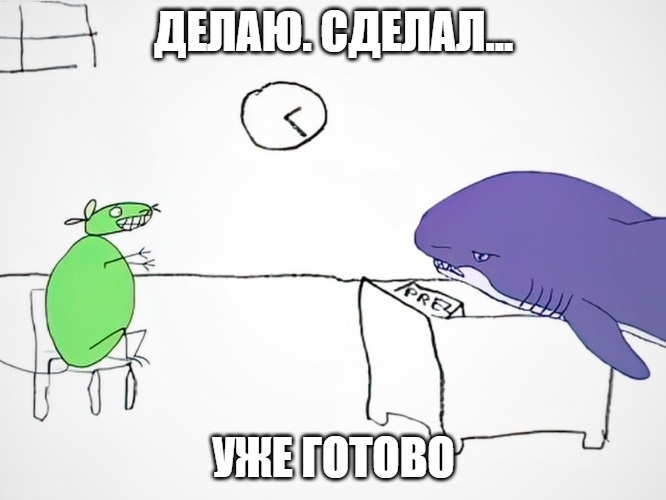
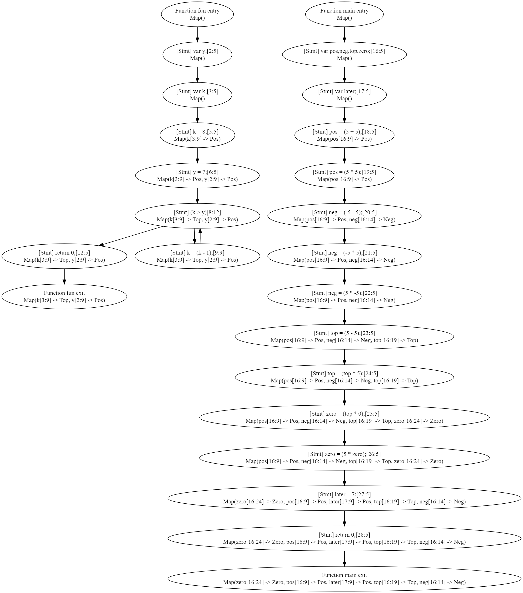

# Вопрос 1

Можно ли выразить анализ типов с предыдущей лекции как анализ над решетками?

- Если да, то как выглядит наша решетка?
- Если нет, то почему?

## Ответ

Да, как минимум достаточно иметь общие для всех типов подтип и надтип. Например, в котлине это `Nothing` и `Any` 
соответственно. Все остальные типы располагаются между ними. В случае, если все типы независимы и не имеют общих 
потомков или родителей, получится плоская решетка. В стандартной библиотеке котлина имеются типы, составляющие иерархию,
например абстрактный класс `Number` и наследующие его подклассы `Long`, `Int`, `Short`, `Byte`, `Double` и `Float`. 
Решетка для них будет выглядеть следующим образом:

```
   ----------------------Any-------------------------
  /                       |                          \
...    ----------------Number-------------------    ...
 |    /    /     /    |      |     \       \    \    |             
 |  ...  Long  Int  Short  Byte  Double  Float  ...  |
 \    \    \     \    |      |     /       /    /    /
  ---------------------Nothing-----------------------
```

Также стоит помнить, что каждый тип котлина может быть nullable (`T?`) и non-nullable (`T`). В решетке выше все типы
`non-nullable` и в дополнение к ней требуется проанализировать такую же решетку, но только в которой все типы являются 
`nullable`.

# Вопрос 2

Можно ли выразить анализ над решетками как анализ типов?

- Короткий ответ: да, можно (subtyping)
- Длинный ответ: подумайте, все ли выразимо в таком случае

## Ответ

Как уже писалось выше, анализ над решетками подразумевает, что у каждого типа есть общий подтип (например `Nothing` из 
котлина). Чтобы применить подобный анализ в реализации анализа типов с предыдущей лекции требуются правила, обозначающие 
все не проинициализированные переменные как некий общий подтип, являющийся нижней границей решетки, а затем по 
необходимости разрешающий этот тип в тип выше по иерархии.

# Вопрос 3

Допишите метод `localTransfer` в трейте `SimpleSignAnalysis`.

Реализуйте класс `PowersetLattice` в файле `GenericLattices`.

## Ответ



Для тестирования анализа знаков использовалась следующая программа:

```
fun(x) {
    var y;
    var k ;

    k = 8;
    y = 7;

    while(k > y) {
        k = k - 1;
    }

    return 0;
}

main() {
    var pos, neg, top, zero;
    var later;
    pos = 5 + 5;
    pos = 5 * 5;    
    neg = -5 - 5;
    neg = -5 * 5;
    neg = 5 * -5;
    top = 5 - 5;
    top = top * 5;
    zero = top * 0;
    zero = 5 * zero;
    later = 7;
    return 0;
}
```

В результате анализатор сгенерировал следующий граф:



Вроде все верно и не противоречиво.
