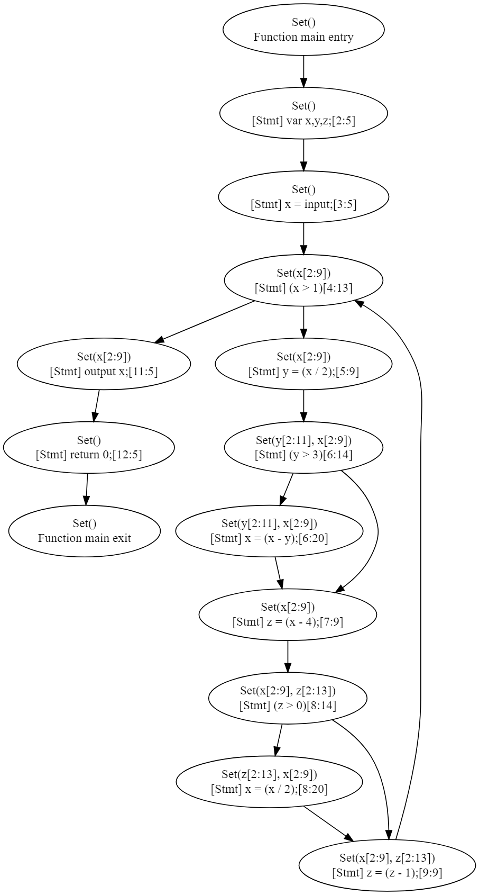
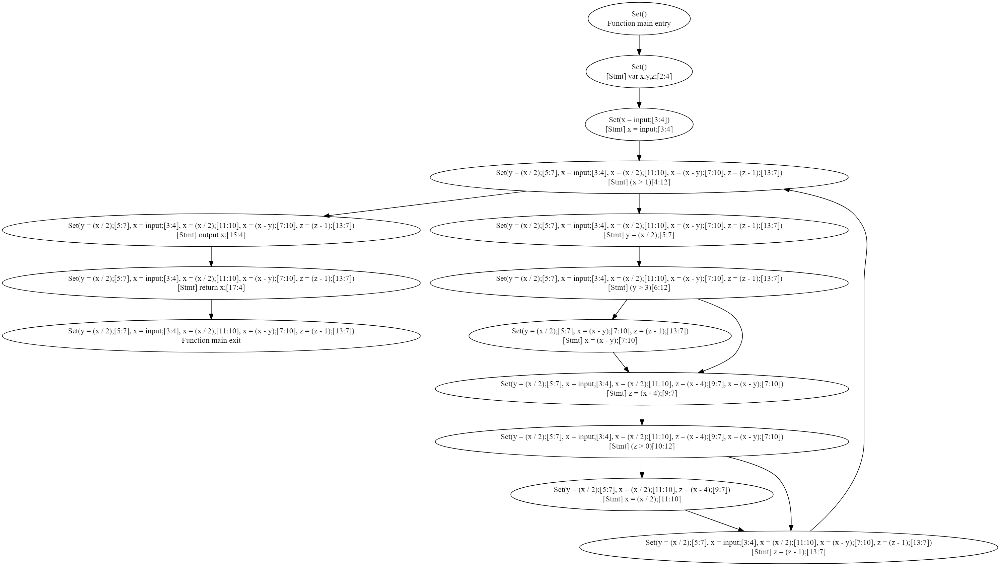

# Вопрос 1

Допишите реализацию live variables analysis

- `src/tip/analysis/LiveVarsAnalysis.scala`

## Ответ

Для тестирования реализованного анализа использовалась следующая программа:

```
main() {
    var x,y,z;
    x = input;
    while (x>1) {
        y = x/2;
        if (y>3) { x = x-y; }
        z = x-4;
        if (z>0) { x = x/2; }
        z = z-1;
    }
    output x;
    return 0;
}
```

В результате анализатор сгенерировал следующий граф:



# Вопрос 2

Реализуйте reaching definitions analysis

- `src/tip/analysis/ReachingDefinitionsAnalysis.scala`

## Ответ

Для тестирования реализованного анализа использовалась следующая программа:

```
main(){
   var x,y,z;
   x = input;
   while (x>1) {
      y = x/2;
      if (y>3){
         x = x-y;
      }
      z = x-4;
      if (z>0){
         x = x/2;
      }
      z = z-1;
   }
   output x;
   
   return x;
}
```

В результате анализатор сгенерировал следующий граф:


