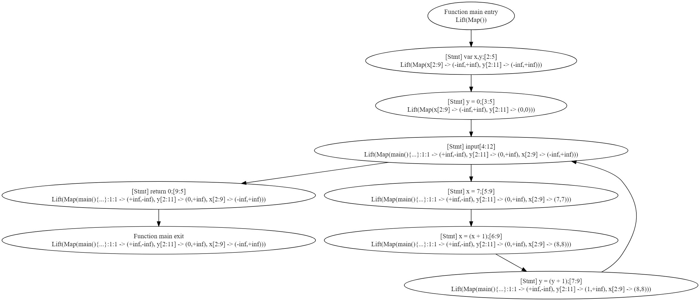
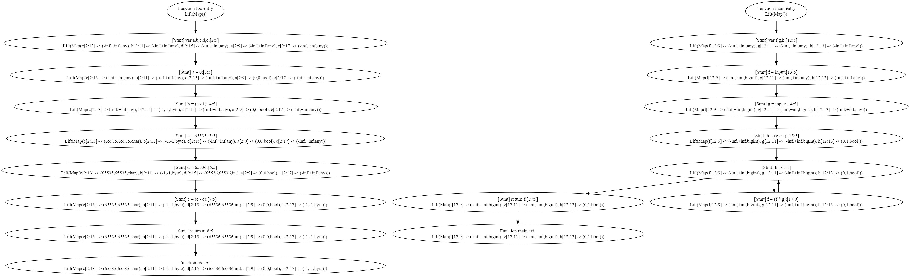

# Вопрос 1

Допустим, мы хотим реализовать оптимизирующий компилятор для языка TIP. Среди прочего, для работы ему требуется
информация о размерах различных переменных:

- `bool` (1 bit)
- `byte` (8 bit signed)
- `char` (16 bit unsigned)
- `int` (32 bit signed)
- `bigint` (any integer)
- `any` (any thing)

`(T) E` — операция приведения типов

Предложите решетку для реализации анализа размера переменных

Нужно описать не только решетку для одного абстрактного значения, но и все другие решетки, требуемые для анализа целой
программы

Опишите правила вычисления различных выражений

Придумайте нетривиальный пример программы на TIP для получившегося анализа и посмотрите, что для него получается

## Ответ

Анализ размера переменных можно построить на основе интервального анализа.

Для этого в решетку значений помимо верхней и нижней границы интервала переменной нужно добавить тип, который должен 
рассчитываться после каждой операции, основываясь на получившемся после операции интервале:

| Тип      | Интервал                    |
|----------|-----------------------------|
| `bool`   | $[0; 1]$                    |
| `byte`   | $[-128; 127]$               |
| `char`   | $[0; 65535]$                |
| `int`    | $[-2147483648; 2147483647]$ |
| `bigint` | $[-\infty; +\infty]$        |
| `any`    | -                           |

Т.к. откровенно говоря все предыдущие анализы не рассматривали саму возможность bigint типа, а применить его нужно, то
пускай bigint можно считать все переменным, которым присваивался `input`. В остальном все правила можно оставить теми 
же, что и для интервального анализа.

# Вопрос 2

Допишите реализацию метода widen в `IntervalAnalysisWorklistSolverWithWidening`

- `src/tip/analysis/IntervalAnalysis.scala`

## Ответ

Для тестирования реализованного анализа использовалась следующая программа:

```
main() {
    var x,y;
    y = 0;
    while (input) {
        x = 7;
        x = x+1;
        y = y+1;
    }
    return 0;
}
```

В результате анализатор сгенерировал следующий граф:



# Вопрос 3

## Ответ

Реализация анализа находится в файле [VarSizeAnalysis.scala](../src/tip/analysis/VarSizeAnalysis.scala).

Для тестирования реализованного анализа использовалась следующая программа:

```
foo() {
    var a,b,c,d,e;
    a = 0;
    b = a - 1;
    c = 65535;
    d = 65536;
    e = c - d;
    return a;
}

main() {
    var f,g,h;
    f = input;
    g = input;
    h = g > f;
    while(h) {
        f = f * g;
    }
    return f;
}

```

В результате анализатор сгенерировал следующий граф:


